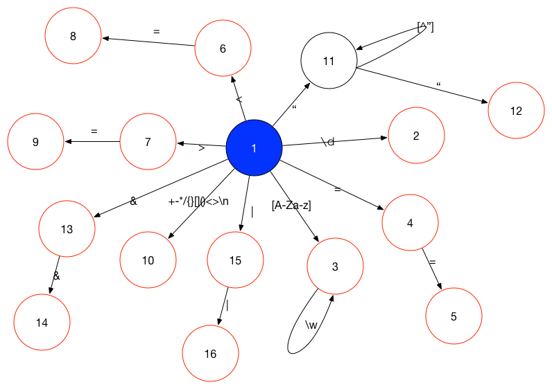

# 简易脚本解释器

* 用Python做为编写解释器的语言

* 语法类似：
    
    
        sum=1
        i=1
        while i<10 {
           sum=sum+i
           i=i+1
        }
        sum

---

### 词法分析器

* 状态图

蓝色背景为开始状态

红色边框为结束状态

* 正则表达式

		regex_pat = r'''
	    \s*(                                        #空白
	    (//.*)|                                     #注释
	    (\d+)|                                      #数字类型
	    ("[^"]*")|                                  #字符串类型
	    [A-Z_a-z][A-z_a-z0-9]*|                     #标识符
	    ==|<=|>=|&&|\|\||                           #符号
	    [\+\-\*/\{\}\=\|\&\[\]\(\)\<\>\;]           #符号
	    )
	    '''

----

### 语法分析器

* BNF范式

		primary   : "(" expr ")" | NUMBER |IDENTIFIER | STRING
		fatctor   : "-" primary | primary
		expr      : factor { OP factor }
		block     : "{" [statement] {(";"|EOL) [statement]} "}"
		simple    : expr
		statement : "if" expr block ["else" block ] 
					| "while" expr block
					|simple
		program   : [statement ](";"|EOL)

